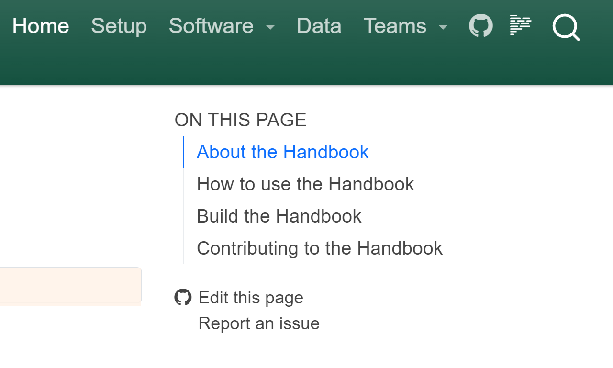

## How to use the Handbook

This handbook serves as shared repository for common tools, methods, and examples of how
IPA develops and implements solutions for data analysis and software development.

We use this handbook to document ways in which we work together on developing code. As
such, this should be a living document that tracks best practices and advice for the
ways in which we work more effectively, learn together, and find joy in our work.

Documentation can seem like a tedious requirement. However, when there is documentation
it helps to reduce the need to start afresh every time something needs to be done.
Moreover, documentation provides a reference point for people to go to _before_ they
need to pursue information via email, chat, or other modes of communication.

Most guidelines in this handbook are intended as reference points. They are not absolute
rules. Every person and team will have their own preferences and ways of working. The
guide is meant to provide reference points for how we work _today_ if someone has
suggestions for improving our work processes, we should approach those suggestions with
an open mind and willingness to understand the perspectives of our colleagues.

## Reading the Handbook

The best ways to read the handbook are the following:

- [Read it on GitHub](https://github.com/PovertyAction/ipa-data-tech-handbook/tree/main/docs)
  or build the handbook from source.
- Read it locally on your computer by cloning the GitHub repository
- Read the handbook at [https://povertyaction.github.io/ipa-data-tech-handbook/docs](https://povertyaction.github.io/ipa-data-tech-handbook/docs)

## Editing the Handbook

All IPA staff should feel empowered to edit this handbook. There are a few ways to edit
the handbook.

A typical workflow to edit the handbook is the following:

1. Make edits.
1. Commit changes to this repository.
1. Create a pull request, assign reviewers.
1. Apply reviewers' suggestions, if any.
1. Merge all changes to the `main` branch of the repository

### A little bit of Markdown

Most of the handbook relies on `Markdown` as the computer language for writing content.
In order to edit the handbook, it is helpful to have a basic understanding of Markdown,
which is the main format in which this handbook's content is written.

Use the existing content of this handbook's `ipa-data-tech-handbook/docs` folder as a
reference for how to write in Markdown.

The following resources are helpful for getting to know the basics of Markdown:

- [GitHub - Basic writing and formatting syntax](https://docs.github.com/en/get-started/writing-on-github/getting-started-with-writing-and-formatting-on-github/basic-writing-and-formatting-syntax)
- [GitHub - Working with advanced formatting](https://docs.github.com/en/get-started/writing-on-github/working-with-advanced-formatting)
- [GitHub Skills: Communicate using Markdown](https://github.com/skills/communicate-using-markdown)
- [Quarto's Guide to Markdown](https://quarto.org/docs/authoring/markdown-basics.html)
- [Markdown Guide Cheat Sheet](https://www.markdownguide.org/cheat-sheet)

### Use the GitHub browser interface to edit the handbook

The easiest way to edit the handbook is to use the GitHub Web IDE. Go to
[https://github.com/PovertyAction/ipa-data-tech-handbook/docs/](https://github.com/PovertyAction/ipa-data-tech-handbook/docs/)
and click on the file you want to edit. Then click on the pencil icon in the top right
corner of the file to start editing.

### Use the GitHub IDE to edit the handbook

Another option that GitHub provides is to edit the handbook documents using a Web-based
integrated development environment (IDE)

### Modify the handbook locally

Note that building the handbook from source code requires the following to be installed
on your local computer (see [Computer Setup](./guides/computer_setup.md) for more
information about software installation):

- `winget` (Windows) or `homebrew` (MacOS/Linux) for package management and installation
- `git` for source control management
- `just` for running common command line patterns
- `rye` for installing Python and managing virtual environments

This repository uses a `Justfile` for collecting common command line actions that we run
to set up the computing environment and build the assets of the handbook. Note that you
should also have Git installed

To get started, make sure you have `Just` installed on your computer by running the
following from the command line:

| Platform  | Commands                                    |
| --------- | ------------------------------------------- |
| Windows   | `winget install Git.Git Casey.Just Rye.Rye` |
| Mac/Linux | `brew install just rye`                     |

As a shortcut, if you already have `Just` installed, you can run the following to
install required software and build a python virtual environment that is used to build
the handbook pages:

```bash
just get-started
```

After the required software is installed, you can activate the virtual environment:

| Shell      | Commands                                |
| ---------- | --------------------------------------- |
| Bash       | `.venv/Scripts/activate`                |
| Powershell | `.venv/Scripts/activate.ps1`            |
| Nushell    | `overlay use .venv/Scripts/activate.nu` |

This will make sure that you have the latest version of `Just`, as well as
[Rye](https://rye.astral.sh/guide/) (installer for Python) and
[Quarto](https://quarto.org/docs/guide/) (for writing and compiling scientific and
technical documents).

- We use `Just` in order to make it easier for all IPA users to be productive with data
  and technology systems. The goal of using a `Justfile` is to help make the end goal of
  the user easier to achieve without needing to know or remember all of the technical
  details of how we get to that goal.
- We use Rye to help ease use of Python. Rye provides a global system for creating and
  building computing environments for Python.
- We use Quarto to allow users to focus on writing and data analytics. Writing in
  markdown, jupyter notebooks, python scripts, R scripts, etc. makes it easier to
  review, update, and deploy technical documentation.

## Preview the handbook

To build a version of the Handbook so that you can read it on your computer, run the
following from a Terminal. Make sure that you are working from the root folder of this
Git Repository:

```bash
just preview-docs
```

The command line above references the
[ipa-data-tech-handbook/\_quarto.yml](../_quarto.yml) file and creates the `.html` files
for the handbook then launches a browser window with a `localhost` server of the
handbook.

## Contributing to the Handbook

You can contribute to this Handbook in a number of ways:

- Edit the code locally on your computer using git

  ```bash
  git clone git@github.com:PovertyAction/dse_handbook.git
  ```

- File an
  [Issue on GitHub](https://github.com/PovertyAction/ipa-data-tech-handbook/issues/new)
  with recommended additions or edits.

- Edit pages of the Handbook on GitHub by clicking on the "Edit this page" link on any
  page of the Handbook.


