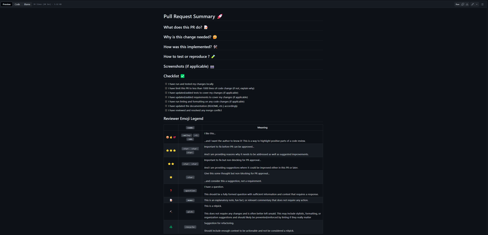

We use code reviews to ensure that code is well-written, well-documented, and follows
best practices. Code reviews are an opportunity to learn from each other, share
knowledge, and improve the quality of our codebase. This document outlines the process
for code reviews and pull requests at IPA.

## As someone requesting code review

- Be courteous and respectful to your reviewer's time.
- Keep your code review focused on changes that are relevant to review.
- Explain why the code changes are necessary.
- When relevant, include screenshots or screencasts to show the effect of the changes.
- Try to respond to every comment that the reviewer makes.
- Merge once you feel confident in the code and its impact on the project.

Recommended reading:
[how to write the perfect pull request](https://github.blog/2015-01-21-how-to-write-the-perfect-pull-request/).

## As a code reviewer

- Communicate which ideas or comments you feel strongly about and those you don't.
- Don't get stuck on details that are not immediately relevant to allow the code author
  to move forward with their work.
- Identify ways to simplify the code while still achieving the project's goal
- If relevant, offer alternative implementations, especially if they would simplify the
  code or make it easier to maintain in the long run.
- Seek to understand the author's perspective
- Approve the pull request in a reasonable amount of time. If you are unable to review
  the code promptly, let the author know when you will be able to review it.
- Remember that you are here to provide feedback, not to be a gatekeeper.

Above is modified from
[Thoughtbot Code Review Guidelines](https://github.com/thoughtbot/guides/tree/main/code-review)

## Use Templates for Pull Requests

For each team or repository, we highly recommend creating a template pull requests. This
helps to standardize the way in which pull requests are created and reviewed.

As an example of a pull request template, see the
[pull request template in this repository](../../.github/pull_request_template.md).

## Code Review Process

1. Create a Pull Request (PR) from a branch to the `main` branch.
1. Add a reviewer or multiple reviewers to the PR.
1. Reviewers will review the code and provide feedback.
1. The author of the PR will address the feedback and make changes.
1. The author will notify the reviewers that the changes have been made.
1. The reviewers will review the changes and approve the PR unless there is a need for
   additional revisions.
1. Once approved, the author can merge the PR into the `main` branch.

## Learning Resources

- GitHub's Guide to [Pull Requests](https://docs.github.com/en/pull-requests)
- [View a Pull Request in GitHub Desktop](https://docs.github.com/en/desktop/working-with-your-remote-repository-on-github-or-github-enterprise/viewing-a-pull-request-in-github-desktop)
- [Creating a Pull Request Template](https://docs.github.com/en/communities/using-templates-to-encourage-useful-issues-and-pull-requests/creating-a-pull-request-template-for-your-repository)
