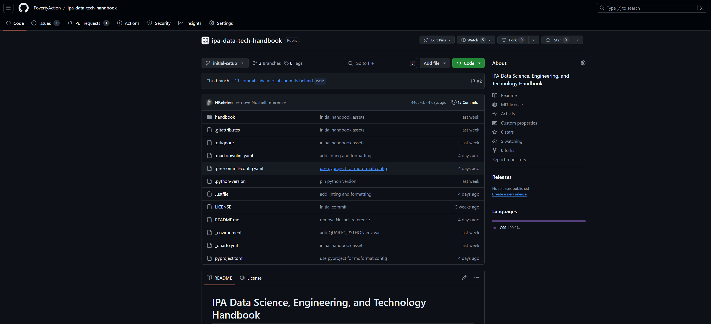

## What is GitHub?

GitHub is a platform for hosting and collaborating on computer code. It is a place where
you can store your code, track changes, and collaborate with others. GitHub is built on
top of Git, a version control system that allows you to track changes in your codebase
over time. GitHub provides a web-based interface for interacting with Git repositories,
as well as a desktop application (GitHub Desktop) and a command-line interface (CLI) for
working with Git repositories on your local computer.

## How to install GitHub Software?

There are two main options to consider for interacting with GitHub from your local
computer:

1. [GitHub Desktop](https://docs.github.com/en/desktop) (Recommended)- GUI for working
   with Git repositories.
1. [GitHub CLI](https://docs.github.com/en/github-cli) - Command-line interface for
   working with Git repositories. For advanced usage.

If you are new to Git or prefer working with a graphical user interface (GUI), we
recommend that you start with GitHub Desktop. The Desktop interface provides a more
transparent way of understanding source control and interacting with remote code
repositories on GitHub.

### GitHub Desktop

| Platform | Commands                              |
| -------- | ------------------------------------- |
| Windows  | `winget install GitHub.GithubDesktop` |
| MacOS    | `brew install --cask github`          |
| Linux    | Not available                         |

### GitHub CLI

| Platform | Commands                    |
| -------- | --------------------------- |
| Windows  | `winget install GitHub.cli` |
| MacOS    | `brew install gh`           |
| Linux    | `brew install gh`           |

## Authenticating GitHub

### GitHub Desktop

See instructions
[here](https://docs.github.com/en/desktop/overview/getting-started-with-github-desktop)
for getting started with GitHub Desktop.

In the File menu, select "Options" and then in the "Accounts" options select "Sign in to
GitHub.com" and "Continue with browser" to authenticate with your GitHub account.


### GitHub CLI

See the [GitHub CLI Manual](https://cli.github.com/manual/) for more information on how
to authenticate with GitHub CLI.

To authenticate with GitHub CLI, run the following command in your terminal:

```bash
gh auth login
```

Then walk through the prompts:

> What account do you want to log into? `GitHub.com`
>
> What is your preferred protocol for Git operations on this host? `HTTPS`
>
> Authenticate Git with your GitHub credentials? (Y/n) `Y`
>
> How would you like to authenticate GitHub CLI? `Login with a web browser`

## Using GitHub

Within a GitHub repository, there are four main aspects that you should be familiar
with:

1. **Code**: The files and directories that make up your project.
1. **Issues**: A place to discuss and track tasks, bugs, and enhancements for a project.
1. **Pull Requests**: A way to propose changes to a repository and discuss them with
   others.



In the **Code** section of a GitHub repository, you can view the files that make up the
project codebase. We work with **Branches** to manage different versions of the
codebase. The `main` branch is the default branch that GitHub uses for the codebase.
When you want to make changes to the codebase, you create a new branch from the `main`
branch, make your changes, and then create a **Pull Request** to merge your changes back
into the `main` branch.

For planning changes to the codebase, you can use **Issues** to track tasks, bugs, and
enhancements. Issues can be assigned to team members, labeled, and linked to Pull
Requests. Issues can also be used to discuss changes to the codebase before making them.

## Learning Resources

- [GitHub Skills](https://skills.github.com/) provides a lot of relevant resources for
  learning how to use GitHub. Some good starting points include:
  - [Introduction to Github](https://github.com/skills/introduction-to-github)
  - [Review Pull Requests](https://github.com/skills/review-pull-requests)
- [GitHub Foundations Certificate](https://learn.microsoft.com/en-us/collections/o1njfe825p602p)
