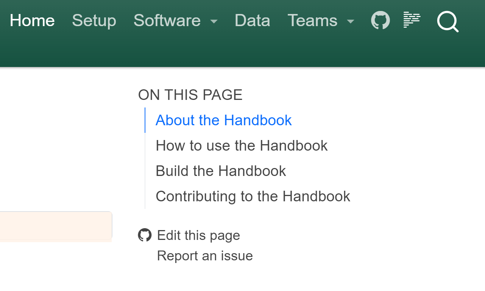

Welcome to IPA's Handbook for Data and Technology!

> \[!WARNING\] This handbook is an early work in progress

## About the Handbook

This handbook is intended as a living document to assist IPA staff and collaborators
with common practices for writing code and working with data. The handbook will never be
comprehensive of every possible software, data object, or shared practice. However, IPA
staff working with data and technology are encouraged to use this handbook as a
reference and a shared project to give tips and advice for working collaboratively with
data analysis and software development.

## How to use the Handbook

Eventually we will have a long-term home for this document. Until then, the best way to
read the document is to build the handbook locally on your computer and view in a
browser.

## Build the Handbook

Note that building the handbook from source code requires the following to be installed
on your local computer (see [Computer Setup](computer_setup.qmd) for more information
about software installation):

- `winget` (Windows) or `homebrew` (MacOS/Linux) for package management and installation
- `git` for source control management
- `just` for running common command line patterns
- `rye` for installing Python and managing virtual environments

```bash
# Windows
winget install Git.Git Casey.Just Rye.Rye

# MacOS/Linux
brew install just rye
```

As a shortcut, if you already have `Just` installed, you can run the following to
install required software and build a python virtual environment that is used to build
the handbook pages:

```bash
just get-started
```

## Preview the handbook

To build a version of the Handbook so that you can read it on your computer, run the
following from a Terminal. Make sure that you are working from the root folder of this
Git Repository:

```bash
just preview-docs
```

The command line above references the `_quarto.yml` file and creates the `.html` files
for the handbook then launches a browser window with a `localhost` server of the
handbook.

## Contributing to the Handbook

You can contribute to this Handbook in a number of ways:

1. File an
   [Issue on GitHub](https://github.com/PovertyAction/ipa_data_tech_handbook/issues/new)
   with recommended additions or edits.
1. Edit pages of the Handbook on GitHub by clicking on the "Edit this page" link on any
   page of the Handbook.



1. Edit the code locally on your computer using git

```bash
git clone git@github.com:PovertyAction/dse_handbook.git
```
